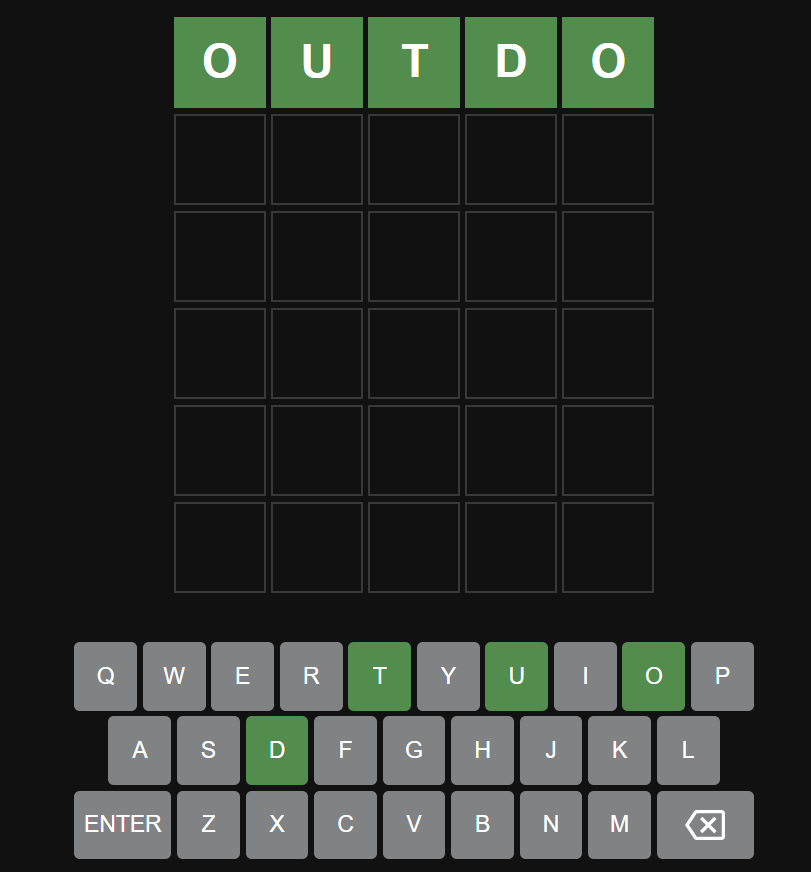

# Clone of the Wordle game

## Instructions

You have 6 attempts to guess the word.

Each guess consists of 5 letters. After providing a guess, press the enter key.

## Color Codes of Letters

In each guess you supply, a correct letter with a position matching its spot in the correct answer will be colored in green.

A correct letter in the wrong spot is colored in yellow.

Last but least, an incorrect letter will be colored in gray.

## Game Preview

